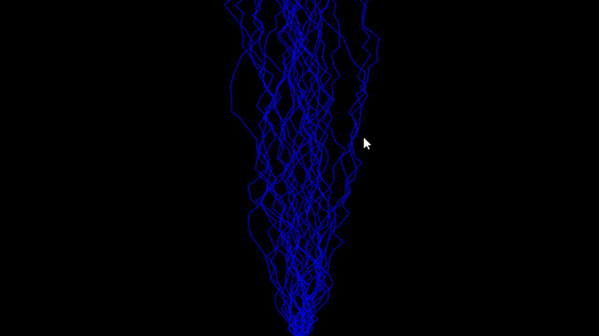
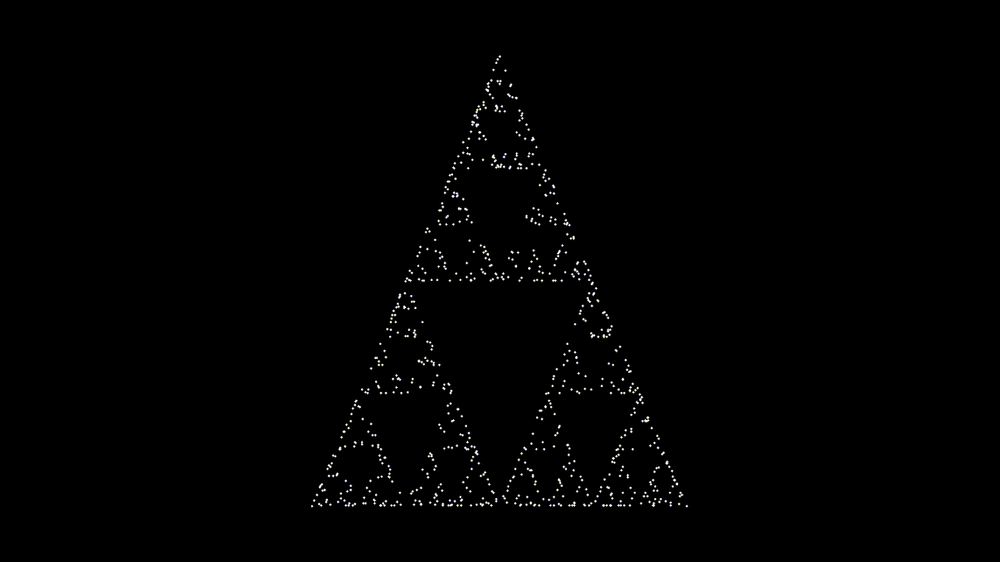

# 🎨🔦 Visual Project Portfolio

As a fun creative challenge, I decided to build a variety of **"art-inspired" projects** using **Python** and **Pygame**. Each project focuses on **mathematical beauty, procedural generation, and interactive visuals** to create **mesmerizing effects**.

---

## 🖌️ Featured Projects  

### 🎭 **Project 1: Art with Math Graphs**  
✨ **Mathematical equations turned into mesmerizing visuals!**  
- 📈 **Customizable graph inputs** to change shapes & patterns.  
- 🔄 **Animated points** dynamically moving to form **hypnotic** designs.  

### ⚡ **Project 2: Regenerating Lightning Effect**  
🌩️ **A storm on your screen!**  
- ⚡ Click anywhere to **generate a fresh lightning pattern**.  
- 🎇 **Procedural animation** ensures every bolt is **unique**.  

### 🦠 **Project 3: Petri Dish Infection Simulation**  
🧫 **A digital world of spreading bacteria!**  
- 🦠 Multiple **"infection points"** randomly placed on screen.  
- 📈 **Spreads and grows naturally** like a colony in a petri dish.  
- 🎨 Creates **organic, evolving patterns** over time.  

### 🔺 **Project 4: Self-Generating Sierpiński Triangle**  
📐 **A famous fractal comes to life!**  
- 🔢 Uses **mathematical chaos theory** to generate the triangle.  
- 🖥️ **Gradually fills out the pattern**, with each point placed dynamically.  
- 🎬 **Watch as structure emerges from randomness!**  

---

## 🎥 Demo
**Art with Math Graphs**


**Lightening Effect**


**Cell Infection Art**


**Sierpinski Triangle Animation**


## 🚀 Installation
1️⃣ Clone the repository:  
```sh
git clone https://github.com/blakeldridge/VisualProjects.git
cd PlanetGravitationSimulation
```
2️⃣ Install Dependencies:
```sh
pip install pygame
```
3️⃣ Run the Program:
**🖼️Art with Math Graphs**
```sh
cd graphArt
python generative_art.py
```

**⚡Lightening Effect**
```sh
cd graphArt
python roots.py
```

**🦠Cell Infection Art**
```sh
cd InfectionArt
python main.py
```

**🔺Sierpinski Triangle Animation**
```sh
cd sierpinskiTriangle
python main.py
```

## 🔧 Technologies Used
- 🐍 Python
- 🎮 Pygame

## 📬 Contact
Created by **[Blake Eldridge](https://github.com/blakeldridge)** - Feel free to reach out! <br>
📧 **Email** : blakeldridge@gmail.com <br>
💼 **LinkedIn** : [blakeldridge](https://www.linkedin.com/in/blake-eldridge/)
